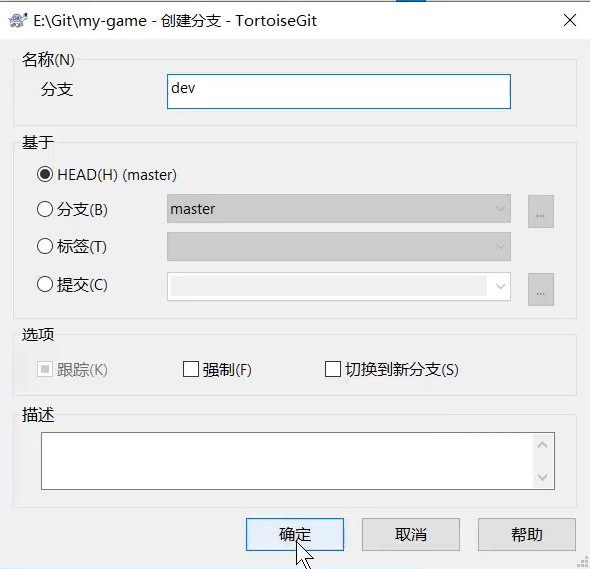
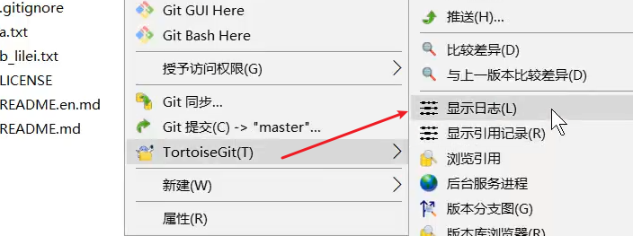
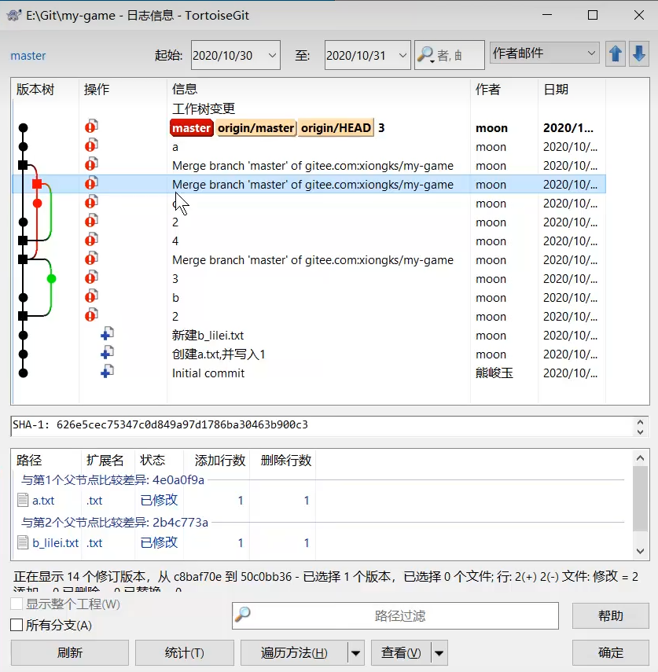

## Master一般不在上面做修改，都是创建分支，然后合并在master分支上

---

 

---
**或者先查看日志，然后在日志上任意一个版本创建分支都可以**

---
### 现在创建一个分支:

1. 用第一个方法创建一个分支

   ​	

2. 切换分支
    		
    切换分支的另一种选择：浏览版本分支图——>
    
    

---

  

### *dev*分支提交之后就会变成：

​	这代表dev分支提交了一次操作，同样在日志里也能看到，注:日志可以看到同一个分支多次提交记录

  

 

<h1>如何合并分支</h1>

1. 先切换到主分支

2. 点击合并功能进行合并操作

    

    

   合并完成 

# 命令行教程

 

 

